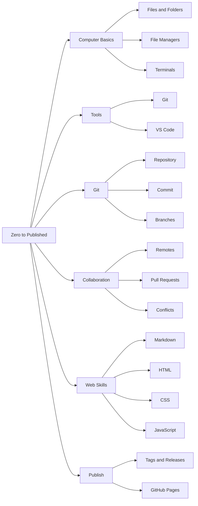
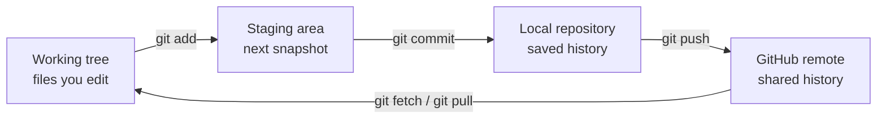
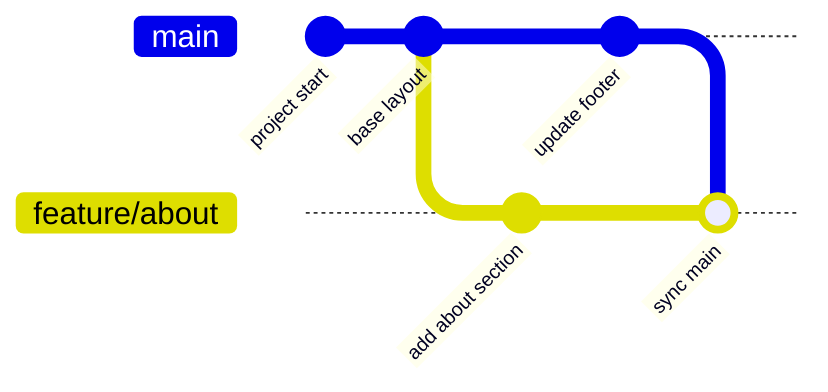
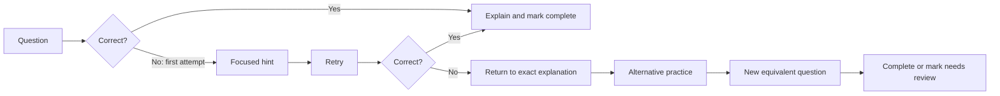

# Git & GitHub: Zero to Published Portfolio

## 1. Document purpose

This document defines the requirements for a beginner-first, interactive learning website that teaches a person with no assumed computer knowledge how to:

1. Use folders, files, graphical file managers, and terminals on Windows, macOS, and Linux.
2. Use Visual Studio Code (VS Code).
3. Understand version control and use Git safely.
4. Collaborate with other people through GitHub pull requests.
5. Build a basic portfolio website with HTML, CSS, JavaScript, and Markdown.
6. Publish that portfolio with GitHub Pages and maintain it through a production-style workflow.

This is a requirements document, not the tutorial itself. It defines the audience, sequence, behavior, content, visuals, assessments, and completion criteria for the future learning product.

---

## 2. Product vision

Create a self-paced, accessible, visual “zero to published” learning path. A learner should be able to arrive without knowing what a folder, terminal, command, repository, or website is and leave with a public portfolio site, a GitHub contribution history, and enough Git knowledge to work safely on a small team.

### 2.1 Primary outcome

At the end of the course, the learner can independently:

- Navigate files and folders with both a graphical interface and a terminal.
- Create, view, edit, copy, move, rename, and delete files safely.
- Install and configure Git and VS Code.
- Create and clone repositories.
- Make commits with meaningful messages.
- Work on feature branches.
- Synchronize a feature branch with the latest shared branch.
- Resolve a simple merge conflict.
- Open, review, update, and merge a pull request.
- Create release tags.
- Build a responsive, accessible portfolio using HTML, CSS, and basic JavaScript.
- Write project documentation in Markdown.
- Deploy and update the portfolio using GitHub Pages.

### 2.2 Product principles

- No unexplained assumptions: define every new term before using it.
- Show before asking: demonstrate, provide guided practice, then assess.
- GUI and terminal parity: show both approaches where both are useful.
- Safe commands first: explicitly explain destructive or irreversible actions.
- One concept per step: avoid large jumps in learner knowledge.
- Visible state: always show the expected screen, path, files, and command output.
- Recovery is part of learning: every practical lesson includes common mistakes and recovery steps.
- Modern defaults: use `main` as the default branch while explaining that older projects may use `master`.
- Real collaboration: distinguish GitHub pull requests (PRs) from merge requests (MRs), the term used by platforms such as GitLab.

---

## 3. Target audience and assumptions

### 3.1 Primary learner

- Has little or no experience using a computer for development.
- May not understand drives, folders, paths, file extensions, terminals, or applications.
- Has access to Windows 11, a currently supported macOS version, or a beginner-friendly Linux distribution such as Ubuntu.
- Can read basic English and follow numbered instructions.
- Does not already have Git, VS Code, a GitHub account, or a website.

### 3.2 Explicitly out of scope for assumed knowledge

The product must not assume the learner knows:

- The difference between a file and a folder.
- How to install an application.
- How to open a terminal.
- What a command, path, URL, browser, editor, source code, or server is.
- How keyboard shortcuts such as `Ctrl+C` differ between graphical apps and terminals.
- What Git, GitHub, Markdown, HTML, CSS, or JavaScript is.

### 3.3 Accessibility needs

- Keyboard-only navigation.
- Screen-reader-compatible structure and labels.
- Captions and transcripts for animation or video.
- Alt text for every instructional image.
- No information conveyed by color alone.
- Zoom support to at least 200% without loss of functionality.
- Plain-language definitions and optional pronunciation for unfamiliar terms.

---

## 4. Scope

### 4.1 In scope

- Computer and filesystem fundamentals on Windows, macOS, and Linux.
- Graphical file manager and terminal workflows.
- PowerShell, Command Prompt, Git Bash, macOS Terminal, and a Linux shell.
- Git for Windows installation, including Git Bash and bundled Unix-style tools.
- VS Code installation and essential use.
- Local Git, GitHub, collaboration, branches, pull requests, conflict resolution, tags, and releases.
- A practical branch/environment workflow using feature, integration, test/staging, and production concepts.
- Markdown, HTML, CSS, basic JavaScript, browser developer tools, responsive design, accessibility, and basic web publishing.
- GitHub Pages deployment.
- Interactive navigation, diagrams, command panels, practice exercises, quizzes, remediation, progress tracking, and a glossary.

### 4.2 Out of scope for the first release

- Advanced system administration.
- Advanced shell scripting.
- Git internals, custom merge drivers, submodules, monorepo tooling, or large-file administration.
- Full JavaScript framework instruction.
- Backend development, databases, authentication, or paid hosting.
- Enterprise GitHub administration.
- Treating a particular branching strategy as universally correct.

### 4.3 Git concept coverage policy

The course must classify concepts by learning priority:

| Level | Meaning | Examples |
|---|---|---|
| Core | Required for the capstone and normal daily work | `init`, `clone`, `status`, `add`, `diff`, `commit`, `log`, `branch`, `switch`, `fetch`, `pull`, `push`, merge, restore, `.gitignore`, remotes, PRs |
| Situational | Taught after the core workflow because it solves a real but less frequent problem | stash, tags, releases, reflog, revert, branch cleanup, forks, `.gitattributes`, Git LFS concepts |
| Advanced/reference | Demonstrated only in a disposable repository with explicit risk guidance | rebase, interactive rebase, cherry-pick, reset modes, `clean`, force-with-lease, bisect |
| Specialist/out of scope | Named and linked as a next step, but not required for a portfolio workflow | submodules, subtree, worktrees, partial clone, sparse checkout, custom merge drivers, server administration |

Potentially destructive commands such as `git clean`, hard reset, branch deletion, and forced updates must never appear as unexplained fixes copied directly into a normal project.

---

## 5. Terminology and technical decisions

### 5.1 Required terminology

| Term | Required explanation |
|---|---|
| Git | Version-control software that records changes locally. |
| GitHub | An online service that hosts Git repositories and collaboration tools. |
| Repository | A project folder whose history Git tracks. |
| Working tree | The files currently visible and editable in the project folder. |
| Commit | A named snapshot of tracked changes. |
| Branch | A movable line of development, not a separate full copy of the project. |
| Remote | A saved name, commonly `origin`, for another repository location. |
| Pull request | GitHub’s review-and-merge workflow. It does not mean `git pull`. |
| Merge request | A similar platform workflow, commonly used as GitLab terminology. |
| Environment | A place where software runs, such as development, testing/staging, or production. |
| Tag | A stable name attached to a specific commit, commonly used for releases. |

### 5.2 Branch naming

- New demonstrations use `main`.
- A compatibility note explains that `master` may be the default in older repositories.
- Commands that refer to the shared branch must visibly identify which name the learner’s repository uses.
- Feature branches use readable names such as `feature/add-project-card`.

### 5.3 Deployment workflow guidance

The course may demonstrate `develop`, `test` or `staging`, and `production` concepts, but it must state that teams use different models. The recommended beginner workflow is:

```text
feature branch -> pull request -> main -> automated deployment
```

An extended team workflow may demonstrate:

```text
feature/* -> develop -> staging/test environment -> main -> production environment
```

The content must explain that environments are not inherently branches. GitHub Actions or platform settings can deploy the same commit to different environments. The tutorial must not encourage directly pushing unreviewed work through deployment branches.

---

## 6. Information architecture and interaction model

### 6.1 Page layout

The learning website must use a three-pane, responsive layout on large screens:

```text
+----------------------+------------------------------+----------------------+
| Learning tree        | Lesson                       | Context panel        |
|                      |                              |                      |
| Module               | Explanation                  | Commands             |
|  -> Topic            | Image / diagram              | Expected output      |
|     -> Step          | Guided activity              | Glossary / help      |
|                      | Checkpoint                    | Common mistakes      |
+----------------------+------------------------------+----------------------+
```

On small screens, these panes become accessible tabs or drawers without losing keyboard navigation.

### 6.2 Left-to-right expandable learning tree

- The left pane is the table of contents.
- Selecting a module expands its topics to the right.
- Selecting a topic expands its steps to the right again, forming a left-to-right tree.
- Each node displays status: not started, in progress, completed, or needs review.
- Selecting a step loads the lesson and its exact commands.
- Deep links must open a specific module/topic/step.
- Browser Back and Forward controls must preserve navigation behavior.
- Expanded/collapsed state and progress persist locally.
- A linear “Previous” and “Next” path is also required for learners who find trees difficult.

Conceptual mind map:



### 6.3 Lesson template

Every lesson must contain, in order:

1. Outcome stated in plain language.
2. Prerequisites with links to missing knowledge.
3. New terms with short definitions.
4. Visual orientation showing where the learner is working.
5. GUI procedure, if applicable.
6. Terminal procedure, if applicable.
7. Copyable commands with operating-system tabs.
8. Explanation of every command and argument.
9. Expected output or visible result.
10. Guided practice.
11. Common mistakes and recovery.
12. Knowledge check.
13. Independent task.
14. Completion criteria and next lesson.

### 6.4 Command block behavior

Each command block must:

- Identify its shell: PowerShell, Command Prompt, Git Bash, zsh, or bash.
- Show the current folder before a command when context matters.
- Avoid showing the prompt symbol as copyable text.
- Provide a Copy button with accessible confirmation.
- Explain placeholders such as `<your-name>` and prevent copying them silently as literal values.
- Show expected output separately from input.
- Label potentially destructive commands and require a confirmation step in simulations.
- Offer Windows, macOS, and Linux variants where syntax differs.

Example equivalence table required in the fundamentals module:

| Goal | PowerShell | Command Prompt | Git Bash / macOS / Linux |
|---|---|---|---|
| Show current folder | `Get-Location` or `pwd` | `cd` | `pwd` |
| List files | `Get-ChildItem` or `ls` | `dir` | `ls` |
| Change folder | `Set-Location folder` or `cd folder` | `cd folder` | `cd folder` |
| Go to parent | `cd ..` | `cd ..` | `cd ..` |
| Create folder | `New-Item -ItemType Directory demo` or `mkdir demo` | `mkdir demo` | `mkdir demo` |
| Create empty file | `New-Item file.txt` | `type nul > file.txt` | `touch file.txt` |
| Display text file | `Get-Content file.txt` or `type file.txt` | `type file.txt` | `cat file.txt` |
| Write simple text | `'Hello' | Set-Content file.txt` | `echo Hello>file.txt` | `echo 'Hello' > file.txt` |

The lesson must clarify that modern PowerShell aliases `cat` to `Get-Content`, while traditional Command Prompt uses `type`. Git Bash provides the Unix `cat` program on Windows.

---

## 7. Sequential curriculum requirements

### Phase 0 — Orientation and safety

#### Module 0.1: How to use the course

- Explain clicking, double-clicking, right-clicking, scrolling, selecting text, typing, common keyboard keys, and copy/paste.
- Explain the difference between instructions, commands, output, placeholders, warnings, and notes.
- Teach how to choose the correct operating-system and shell tab.
- Provide a no-risk interaction practice.

#### Module 0.2: Computer safety for the course

- Explain save, undo, Recycle Bin/Trash, backups, downloads, and trusted sources.
- Explain why a learner must not paste an unexplained command into a terminal.
- Identify destructive operations such as permanent deletion and force options.
- Explain that passwords, access tokens, private keys, and `.env` secrets must not be committed.

### Phase 1 — Files, folders, paths, and terminals

#### Module 1.1: Files and folders

- Define file, folder/directory, filename, extension, drive, home folder, path, absolute path, and relative path.
- Show Windows path separators (`\`) and macOS/Linux separators (`/`).
- Explain hidden files and file extensions.
- Create the course workspace `learn-git` using:
  - Windows File Explorer.
  - macOS Finder.
  - Ubuntu Files or a comparable Linux file manager.
- Create, rename, move, copy, and delete a practice folder and text file in each GUI.
- Require visual confirmation of the current location before each operation.

#### Module 1.2: Navigating graphical file managers

- Address bar/path bar, breadcrumbs, sidebar, search, sorting, views, Back, Forward, and parent-folder navigation.
- Navigate from a parent folder into nested folders and back out.
- Explain downloads versus documents and how to avoid losing files.
- Show how to reveal filename extensions and hidden files safely.

#### Module 1.3: Terminals and shells

- Define terminal, shell, command, prompt, argument, option/flag, output, error, and exit code.
- Open PowerShell, Command Prompt, Git Bash, macOS Terminal, and Ubuntu Terminal.
- Explain that terminal programs and command availability differ by shell.
- Practice `pwd`/`Get-Location`, `ls`/`dir`/`Get-ChildItem`, and `cd`/`Set-Location`.
- Cover spaces in paths, quoting, `.`, `..`, home (`~` where supported), root, Tab completion, command history, and `Ctrl+C` cancellation.
- Teach absolute and relative navigation through a three-level practice tree.

#### Module 1.4: Creating and reading files in terminals

- Create folders and files.
- Write, append, and display plain text.
- Compare `type`, `Get-Content`, PowerShell’s `cat` alias, and Unix `cat`.
- Open a file in a GUI editor from the terminal.
- Explain output redirection (`>` replaces, `>>` appends) with a visible data-loss warning.
- Move, copy, rename, and safely remove practice content.

### Phase 2 — Install and understand development tools

#### Module 2.1: Accounts and prerequisites

- Create a GitHub account, verify email, choose a durable username, and enable multi-factor authentication.
- Explain public versus private repositories and public profile implications.
- Explain password managers and recovery codes without collecting secrets.

#### Module 2.2: Install Git

- Install Git for Windows from the official source.
- Explain installer choices in beginner language.
- Select Git Bash and the bundled Unix tools during Git for Windows setup.
- Explain PATH choices and the difference between using Git from Git Bash, Command Prompt, PowerShell, and third-party software.
- Address line-ending selection (`core.autocrlf`) and why Windows and Unix line endings differ.
- Install Git on macOS using the supported command-line tools/package route and on Ubuntu using the platform package manager.
- Verify with `git --version` and locate Git with the shell-appropriate command.
- Explain update and uninstall paths.

#### Module 2.3: Configure Git

- Configure `user.name`, `user.email`, default branch `main`, and a safe credential helper.
- Explain global versus repository-specific configuration.
- Inspect configuration and identify where a value came from.
- Explain privacy options for the GitHub email address.
- Introduce HTTPS authentication and GitHub personal access/token behavior without exposing secrets.
- Offer SSH as a later optional lesson, including key generation, passphrases, and host verification.

#### Module 2.4: Install and use VS Code

- Install VS Code from the official source on each OS.
- Explain Windows PATH and “Open with Code” installer choices.
- Identify Explorer, editor tabs, breadcrumbs, Source Control, integrated terminal, status bar, Extensions, Command Palette, and Settings.
- Open a folder rather than only an individual file.
- Create, edit, save, rename, and delete a file through VS Code Explorer.
- Open the integrated terminal and identify its active shell.
- Install only essential extensions, with justification and publisher verification.
- Explain Workspace Trust.

### Phase 3 — Version-control foundations

#### Module 3.1: Why version control exists

- Use a visual story comparing manual files such as `final`, `final-2`, and `final-really-final` with recorded history.
- Explain snapshots, authorship, history, comparison, recovery, parallel work, and collaboration.
- Distinguish Git from GitHub and local from remote work.
- Include a “three areas” diagram: working tree, staging area, repository.



#### Module 3.2: Create a local repository

- Create a project folder in the GUI and terminal.
- Open it in VS Code.
- Run `git init` and explain the hidden `.git` directory without encouraging manual edits inside it.
- Inspect `git status` before and after every state change.
- Create `README.md` and `.gitignore`.
- Stage and commit through both the terminal and VS Code Source Control.
- Inspect history with `git log` and VS Code’s available history UI.

#### Module 3.3: The edit-stage-commit cycle

- Modify multiple files and selectively stage one change.
- Explain tracked, untracked, modified, staged, and committed states.
- Compare working changes, staged changes, and commits.
- Unstage a file and discard a deliberately created practice change safely.
- Write concise, action-oriented commit messages.
- Explain commit frequency and logical commits.

#### Module 3.4: Ignore generated and private files

- Explain `.gitignore` patterns with folders, file types, and explicit exceptions.
- Explain why ignoring a file does not stop tracking it after it has already been committed.
- Include examples for editor files, OS metadata, build output, dependencies, and `.env` files.
- Add a secret-safety checkpoint before the first push.

#### Module 3.5: Recover from beginner mistakes

- Restore an unstaged change.
- Unstage without deleting work.
- Amend the most recent local commit before sharing.
- Revert a shared commit using a new commit.
- Explain why reset, force push, and history rewriting are deferred and dangerous on shared branches.
- Use a decision diagram that routes learners to the appropriate safe recovery method.

### Phase 4 — GitHub and remote repositories

#### Module 4.1: Create a GitHub repository and connect it

- Create an empty remote repository through GitHub’s UI.
- Explain owner, name, description, visibility, README initialization, and license choices.
- Connect an existing local repository with `git remote add origin`.
- Inspect remotes, push `main`, and set upstream tracking.
- Perform equivalent supported actions in VS Code.
- Verify local and GitHub file/history views match.

#### Module 4.2: Clone an existing repository

- Copy the HTTPS repository URL from GitHub.
- Choose and verify the parent destination folder before cloning.
- Clone through a terminal and VS Code.
- Explain that `git clone` creates the project directory, local history, `origin`, and a checked-out branch.
- Prevent the common nested-folder mistake.
- Open, inspect, and run a cloned static website locally.

#### Module 4.3: Fetch, pull, and push

- Explain data direction with animations or diagrams.
- Compare `git fetch`, `git pull`, and `git push`.
- Inspect incoming changes before integration.
- Explain upstream/tracking branches and ahead/behind indicators.
- Recover from a rejected non-fast-forward push without using force.

### Phase 5 — Branching and individual feature work

#### Module 5.1: Understand branches

- Show commits as a graph and a branch as a movable label.
- Create `feature/add-about-section` from an updated `main`.
- Switch branches with `git switch` and explain older `git checkout` syntax for compatibility.
- List local and remote branches.
- Teach the effect of uncommitted changes when switching.
- Perform branch operations in both terminal and VS Code.



#### Module 5.2: Complete a feature branch

- Make small commits on the feature branch.
- Compare the branch with `main`.
- Push the branch and set its upstream.
- Explain why direct pushes to protected shared branches are avoided.
- Delete merged local and remote feature branches safely.

#### Module 5.3: Synchronize before review

Required safe workflow:

```text
Save or commit feature work
        |
        v
Fetch origin
        |
        v
Update local main from origin/main
        |
        v
Return to feature branch
        |
        v
Merge main (beginner default) or rebase (advanced option)
        |
        v
Resolve conflicts and test
        |
        v
Push feature branch
```

- Teach `git fetch origin` before synchronization.
- Update `main` using a fast-forward-only pull where appropriate.
- Merge `main` into the feature branch as the beginner-safe default.
- Explain rebase later as an optional team-policy-dependent workflow.
- Never instruct a learner to merge a feature into development/test/production without review.

### Phase 6 — Collaboration with multiple contributors

#### Module 6.1: Collaboration models

- Explain collaborator access in a shared repository.
- Explain fork-based contribution when the contributor cannot push to the original repository.
- Use two named learner personas to make ownership and direction clear.
- Cover `origin` and optional `upstream` remotes.
- Explain branch protection, required reviews, status checks, and least privilege.

#### Module 6.2: Pull requests and merge requests

- User A creates and pushes a feature branch.
- User A opens a GitHub pull request into the agreed target branch.
- User B reviews files changed, leaves comments, requests changes, or approves.
- User A makes additional commits; the same PR updates automatically.
- Checks pass; an authorized user merges.
- Explain merge commit, squash merge, and rebase merge at a beginner-appropriate level.
- Delete the feature branch and update local `main`.
- Provide a terminology note and conceptual equivalent for GitLab merge requests.
- Show both GitHub UI and VS Code’s supported PR workflow; terminal commands cover local Git operations, while PR creation may optionally use GitHub CLI in an advanced lesson.

#### Module 6.3: Merge conflicts

- Create a controlled conflict between two users editing the same line.
- Explain conflict markers and the three versions involved.
- Resolve through the text editor and VS Code Merge Editor.
- Run checks, stage the resolution, complete the merge, and push.
- Require reading and editing the result rather than blindly choosing “Accept All.”
- Include abort/restart instructions for a practice merge.

#### Module 6.4: Team workflow and environments

- Define development, test/staging, and production environments.
- Present a simple GitHub Flow workflow first.
- Present an optional promotion workflow using `develop`, `staging`, and `main`, with pull requests at every promotion boundary.
- Synchronize a feature branch from its actual target branch before opening or updating a PR.
- Explain why a feature should not be repeatedly merged through unrelated long-lived branches by hand.
- Introduce automated checks and deployments as the reliable promotion mechanism.
- Include an environment/branch mapping table for the sample project while labeling it as a project convention.

### Phase 7 — Tags, releases, and production history

#### Module 7.1: Tags

- Explain lightweight versus annotated tags; use annotated tags for course releases.
- Explain semantic versioning in practical terms: `v1.0.0`, `v1.1.0`, `v1.1.1`.
- Create, inspect, push, and verify a tag.
- Explain that tags identify commits and should not silently move after publication.
- Demonstrate correction using a new version rather than casually overwriting a published tag.

#### Module 7.2: GitHub releases

- Create a GitHub release from a tag.
- Write short release notes from merged work.
- Link a release to deployed portfolio changes.
- Explain source archives and release assets.

### Phase 7A — Complete Git toolkit and repository health

This phase closes practical gaps after the learner understands the normal collaboration cycle. Topics are classified so learners know which commands are essential, situational, or advanced.

#### Module 7A.1: Inspect before changing

- Make `git status` the default safety check before and after an operation.
- Use `git diff`, `git diff --staged`, and branch/commit comparisons.
- Use `git log`, concise graph views, `git show`, and `git blame` for investigation without presenting blame as a people-management tool.
- Use `git help`, `git <command> --help`, and command summaries to discover syntax.
- Explain commit hashes, abbreviated hashes, `HEAD`, parent references, and branch/tag names as ways to identify commits.
- Show the same inspection tasks through VS Code where supported.

#### Module 7A.2: How Git tracks files

- Explain untracked, ignored, tracked, unchanged, modified, staged, and committed states as a file lifecycle.
- Explain that Git primarily records project snapshots and derives diffs for display.
- Cover `git add <file>`, `git add .`, interactive/partial staging, `git rm`, and `git mv`.
- Explain rename detection and why Git does not store a permanent “renamed file” record in the simplistic sense.
- Explain empty folders and the common `.gitkeep` convention, noting that `.gitkeep` has no special meaning to Git.
- Introduce text versus binary files and why large binary files require different handling.

#### Module 7A.3: `.gitignore` in depth

- Explain the purpose and limits of `.gitignore`: it prevents matching untracked files from being offered for tracking; it is not encryption, access control, or a way to erase committed history.
- Cover comments, blank lines, directory patterns, filename patterns, wildcards, rooted patterns, negation, and nested `.gitignore` files.
- Show repository `.gitignore`, personal global ignore rules, and `.git/info/exclude`, with guidance on when each is appropriate.
- Use `git check-ignore -v` to explain which rule ignored a file.
- Stop tracking an already committed generated file without deleting the learner’s local copy, then commit the change.
- Include templates for common operating-system files, VS Code settings decisions, dependencies, build output, logs, caches, local configuration, and secrets.
- Explain why placeholder environment documentation such as `.env.example` may be committed while real `.env` values must not be.
- Include a response path for an accidentally committed secret: revoke/rotate it first, remove it from current files, and seek appropriate history-cleanup guidance.

#### Module 7A.4: Temporary work and context switching

- Prefer a small work-in-progress commit when appropriate and explain team conventions.
- Teach `git stash` only after commits and branches are understood.
- Cover listing, inspecting, applying, popping, and dropping stashes, including untracked-file behavior.
- Explain that a stash is local, easy to forget, and not a backup or collaboration mechanism.
- Demonstrate switching to urgent work, completing it, returning, and restoring the original changes.

#### Module 7A.5: Undo and recovery decision guide

- Choose recovery based on whether a change is uncommitted, staged, committed locally, or already shared.
- Cover `git restore`, `git restore --staged`, commit amendment, and `git revert` as the core safe tools.
- Introduce `git reset` modes only in an advanced, disposable repository with a clear working-tree impact table.
- Introduce `git reflog` as a local recovery record and recover a deliberately lost practice commit.
- Explain detached `HEAD`, how it occurs, and how to preserve work by creating a branch.
- Explain merge and rebase abort operations in controlled exercises.
- Treat force push as advanced; if shown, prefer `--force-with-lease`, explain its risks, and prohibit it on protected/shared branches unless team policy explicitly permits it.

#### Module 7A.6: Remote and branch maintenance

- Add, inspect, rename, and remove remotes.
- Explain local branches, remote-tracking branches, and upstream tracking relationships.
- Fetch all remotes and prune stale remote-tracking references.
- Rename a local branch and update its remote/upstream safely.
- Delete fully merged branches and diagnose why Git may refuse deletion.
- Compare branches before cleanup.
- Explain forks with `origin` pointing to the learner’s fork and `upstream` pointing to the source project.

#### Module 7A.7: Integration choices

- Compare fast-forward, three-way merge, squash merge, and rebase using the same small commit graph.
- Explain when merge conflicts can occur and why a conflict is not a Git failure.
- Teach rebase as an optional history-rewriting technique after merge is mastered.
- Cover interactive rebase only in advanced/reference content for cleaning local, unpublished commits.
- Introduce cherry-pick as a situational tool for applying a specific commit, not the normal method for synchronizing branches.
- Explain why repeated indiscriminate cherry-picks and long-lived branches make integration harder.

#### Module 7A.8: Repository structure and attributes

- Explain the `.git` directory, working tree, bare repository concept, and why hosted remotes do not expose a normal editable working tree.
- Cover repository-root files: `README.md`, `.gitignore`, `.gitattributes`, `LICENSE`, `CONTRIBUTING.md`, `CODE_OF_CONDUCT.md`, and security guidance.
- Use `.gitattributes` for intentional text normalization and explain line endings across Windows, macOS, and Linux.
- Introduce Git LFS as an optional solution for appropriate large binary assets, including hosting limits and cost considerations; it is not required for the starter portfolio.
- Explain executable permission changes on Unix-like systems and why unexpected mode-only diffs may appear.

#### Module 7A.9: GitHub project workflow

- Create and manage issues with clear titles, reproduction steps, acceptance criteria, labels, assignees, and milestones.
- Link commits and pull requests to issues using supported keywords.
- Use draft pull requests for incomplete work.
- Use review comments, suggestions, approvals, requested changes, and conversations responsibly.
- Explain `CODEOWNERS`, branch rules/rulesets, required reviews, required checks, and merge queues as team-scale options.
- Add issue and pull request templates only after demonstrating the underlying communication practices.
- Explain repository visibility, collaborators, teams, roles, notifications, watching, starring, and forking.
- Explain GitHub Discussions and Wikis as optional communication/documentation tools and when repository Markdown is preferable.

#### Module 7A.10: Automation and repository safety

- Introduce continuous integration as automated validation of proposed changes.
- Read a small GitHub Actions workflow and identify trigger, job, runner, steps, and result.
- Add checks for HTML, links, formatting, or accessibility to the portfolio project.
- Explain workflow permissions, pinned actions, untrusted pull requests, secrets, and why secrets must not be printed.
- Introduce dependency update and security alerts at a conceptual level.
- Explain signed commits/tags and verified badges as optional identity/integrity measures without making them a beginner prerequisite.
- Explain local Git hooks as optional local automation and clarify that ordinary hooks are not automatically shared by cloning.

#### Module 7A.11: Troubleshooting Git methodically

- Capture the exact command, current folder, shell, full error, `git status`, current branch, and configured remotes before changing anything.
- Diagnose “not a git repository,” wrong folder, path-with-spaces, identity not configured, authentication failure, permission denied, unrelated histories, rejected push, detached `HEAD`, unfinished merge/rebase, ignored file, line-ending noise, and case-only filename problems.
- Teach learners to read errors before copying suggested commands.
- Require a backup branch or copy before advanced history repair.
- Provide a searchable error-message index linked to the exact recovery lesson.

#### Module 7A.12: Advanced investigation reference

- Use `git bisect` in a prepared repository to locate the commit that introduced a controlled defect.
- Explain `git clean` with a dry run first and use it only in a disposable exercise; contrast untracked files with ignored files.
- Create an archive of a tagged source tree as an optional distribution task.
- Explain shallow clones, sparse checkout, worktrees, submodules, and subtree only at a conceptual “recognize and research” level.
- Direct learners to project-specific documentation before using advanced features in an existing repository.

### Phase 8 — Markdown and project documentation

#### Module 8.1: Markdown fundamentals

- Explain why Markdown is useful: readable plain text, portable formatting, version-control-friendly diffs, and native GitHub rendering.
- Cover headings, paragraphs, emphasis, lists, links, images, blockquotes, inline code, fenced code, tables, task lists, and horizontal rules.
- Explain relative links and image paths.
- Preview Markdown in VS Code and GitHub.
- Avoid inaccessible heading order and meaningless link text.

#### Module 8.2: Professional README

- Create a README with project purpose, screenshot, live demo, features, technologies, setup, usage, accessibility notes, license, and author/contact links.
- Add badges only when accurate and useful.
- Add `LICENSE`, contribution guidance, and attribution where appropriate.
- Review README changes through a pull request.

### Phase 9 — Website foundations

#### Module 9.1: How a website works

- Explain browser, URL, domain, file, web page, website, server, request, response, and hosting.
- Explain the roles of HTML (structure), CSS (presentation), and JavaScript (behavior).
- Contrast local files with a deployed site.
- Introduce browser developer tools and the console.

#### Module 9.2: HTML

- Create valid document structure with `doctype`, language, metadata, title, body, and viewport.
- Use semantic landmarks: header, navigation, main, sections, article, and footer.
- Add headings, paragraphs, lists, links, images, project cards, and a contact section.
- Explain relative paths and `index.html`.
- Add meaningful alternative text and form labels where applicable.
- Validate markup using an open-source or standards-based validator.

#### Module 9.3: CSS

- Explain selectors, declarations, cascade, inheritance, specificity, units, colors, typography, box model, spacing, and layout.
- Use Flexbox and Grid for the portfolio layout.
- Create responsive behavior with a mobile-first approach and media queries.
- Explain visible focus styles, readable contrast, reduced motion, and consistent spacing.
- Organize styles without introducing a framework requirement.

#### Module 9.4: Basic JavaScript

- Explain values, variables, functions, events, conditionals, arrays, and DOM selection at a practical level.
- Add one useful progressive enhancement, such as an accessible navigation toggle or project filter.
- Keep core content usable when JavaScript is unavailable.
- Use the browser console to identify a controlled error.

#### Module 9.5: Website quality

- Test links, images, navigation, keyboard access, responsive layouts, and browser console errors.
- Introduce performance basics: optimized images, dimensions, minimal assets, and avoiding unnecessary scripts.
- Introduce SEO basics: descriptive title, description, headings, and share metadata.
- Explain licenses and attribution for code, fonts, icons, and images.
- Ensure no private personal information or secrets are published.

### Phase 10 — Capstone: portfolio and GitHub Pages

#### Module 10.1: Plan the portfolio

- Define audience, goal, sections, content inventory, and visual hierarchy.
- Required sections: introduction, about, skills, projects, and contact links.
- Create issues or a checklist for the work.
- Create a simple wireframe using a code-based diagram.
- Define completion and accessibility criteria before implementation.

#### Module 10.2: Build through feature branches

- Create a repository from an approved starter structure or from scratch.
- Build each major section on a separate feature branch.
- Use commits, PR self-review, and checks for each feature.
- Keep `main` deployable.
- Add Markdown project documentation and a screenshot.

#### Module 10.3: Publish with GitHub Pages

- Explain public visibility and repository/site URL formats.
- Configure Pages using the current supported GitHub UI and a branch-based or Actions-based source, chosen by course version.
- Ensure paths work under a project-site base URL.
- Verify deployment status and open the live site.
- Troubleshoot missing `index.html`, case-sensitive filenames, incorrect relative paths, failed workflows, and stale browser cache.
- Link the live site from the repository About section and README.

#### Module 10.4: Release and maintain

- Tag the first public version as `v1.0.0`.
- Create release notes.
- Make a post-launch change through a feature branch and PR.
- Confirm deployment and create an appropriate patch or minor version.
- Explain custom domains, DNS, HTTPS, analytics/privacy, and automated testing as optional next steps.

---

## 8. Visual and diagram requirements

### 8.1 Visual frequency

Every procedural lesson must include at least one visual for each major state change. A “visual” may be:

- An annotated screenshot.
- A short captioned animation.
- An SVG diagram.
- A Mermaid diagram rendered from code.
- A simulated terminal or file manager state.

Text-only decoration does not satisfy this requirement.

### 8.2 Screenshot requirements

- Provide current screenshots for Windows, macOS, and Linux when interfaces differ materially.
- Crop to the relevant region while retaining enough context for orientation.
- Number callouts in the same order as instructions.
- Blur or replace personal data, tokens, email addresses, and machine-specific paths.
- Provide descriptive alt text and a longer text alternative when the image carries complex information.
- Store source and optimized image variants with documented licensing.
- Add a version label because GitHub, VS Code, and operating-system interfaces change.

### 8.3 Required code-based diagrams

- Course mind map.
- File/folder hierarchy tree.
- Absolute versus relative path diagram.
- Git working tree/staging/repository/remote flow.
- Commit and branch graph.
- Fetch/pull/push direction diagram.
- Pull request lifecycle.
- Merge conflict lifecycle.
- Feature-to-production promotion flow.
- GitHub Pages build/deploy flow.
- Recovery decision tree.
- Tracked-file state lifecycle.
- Merge versus rebase comparison.
- Fork, `origin`, and `upstream` relationship.
- Issue-to-branch-to-PR-to-release lifecycle.

Mermaid is the preferred open-source diagram format. Plain-text fallback content is required when a diagram cannot render.

### 8.4 Open-source supporting tools

The implementation should evaluate and document the licenses of:

- Mermaid for code-based diagrams.
- Docusaurus, VitePress, or Astro/Starlight for the documentation site.
- Shiki or Prism for syntax highlighting.
- Monaco Editor or CodeMirror for optional safe code exercises.
- xterm.js for optional simulated terminal exercises.
- axe-core for automated accessibility checks.
- Playwright for end-to-end navigation and interaction tests.

Final selection must prioritize accessibility, maintainability, static GitHub Pages output, and minimal learner download size.

---

## 9. Assessment, feedback, and remediation

### 9.1 Assessment types

Every topic level must include at least:

- One recognition question: identify a concept or safe action.
- One prediction question: predict command or Git state.
- One practical task: perform an action in a simulation or local project.
- One recovery question: diagnose and fix a common mistake.

Question formats may include multiple choice, multiple select, ordering, matching, command completion, path construction, state prediction, and guided practical validation.

### 9.2 Feedback behavior

- Give immediate feedback after an answer.
- Explain why the chosen answer is correct or incorrect.
- Do not reveal the correct answer before the first attempt unless accessibility needs require it.
- After one mistake, provide a focused hint.
- After two mistakes, link to the exact lesson section and show a short refresher.
- After the refresher, provide a different question testing the same concept.
- Never trap the learner in an endless loop; allow review, retry, or continue with a visible “needs review” status.

Remediation flow:



### 9.3 Mastery rules

- A lesson is complete after the guided activity and knowledge check are completed.
- A module is mastered after at least 80% of its scored checks and all required practical tasks.
- Failed questions remain in a review queue.
- The capstone requires a working repository, documented Git history, at least one merged feature PR, and a live GitHub Pages URL.
- The learner can reset progress or revisit any lesson at any time.

### 9.4 Example checkpoint requirements

The question bank must include scenarios such as:

- “You are in `portfolio/images`. Which command returns to `portfolio`?”
- “Which command displays a text file in Command Prompt? In Git Bash?”
- “Which changes will the next commit contain?” based on a status diagram.
- “Your push was rejected because GitHub has a newer commit. What is the safe next action?”
- “Should `.env` be committed?” with an explanation of secrets.
- “What is the difference between a pull request and `git pull`?”
- “Which branch should this feature branch synchronize from?” based on its PR target.
- “Why does `Images/photo.png` fail on GitHub Pages when the folder is named `images`?”

---

## 10. Functional requirements

### FR-1: Operating-system paths

The learner can select Windows, macOS, or Linux. The selection persists and controls screenshots, terminology, paths, keyboard shortcuts, installation steps, and default terminal examples.

### FR-2: Shell selection

Windows learners can switch among PowerShell, Command Prompt, and Git Bash. The site must never present shell-specific syntax without identifying the shell.

### FR-3: Expandable table of contents

The site provides the left-to-right expandable tree described in Section 6, along with linear and searchable navigation.

### FR-4: Search and glossary

Search must find lessons, commands, errors, and glossary terms. Hover, focus, or selection of a glossary term exposes a short definition without losing the learner’s place.

### FR-5: Command reference

A filterable reference maps common tasks across supported shells and links each command to its teaching lesson and safety notes.

### FR-6: Interactive simulations

High-risk or confusing operations should first be practiced in a sandboxed simulation. Simulations must not execute arbitrary commands on the learner’s computer.

### FR-7: Progress

The site stores lesson completion, quiz attempts, review items, operating system, shell choice, and last location. The first release may use browser storage and must offer export/reset controls.

### FR-8: Responsive content

All lessons, trees, tables, diagrams, code blocks, and quizzes must work at phone, tablet, and desktop widths.

### FR-9: Versioned content

UI-sensitive lessons display a last-verified date and relevant product version. Broken or outdated screenshots can be reported from the lesson.

### FR-10: Capstone validation

The course provides a checklist or validator for expected portfolio files, internal links, image paths, metadata, accessibility basics, repository visibility, Pages configuration, and live URL.

### FR-11: Offline-friendly core

After initial load, core text, diagrams, and progress should remain usable under a poor connection where technically feasible. External operations such as GitHub account creation and deployment remain online-only.

### FR-12: Content contribution

Lesson content, diagrams, questions, and image metadata must be stored in version-controlled, reviewable formats. Contributors must be able to preview changes locally and validate links, code blocks, and front matter.

### FR-13: Course introduction before lessons

The root page must explain the course purpose, target learner, scope, roadmap, end outcomes, practical capstone, and differences from command-reference websites before directing the learner into lesson content.

### FR-14: Read-aloud focus support

The application must provide optional browser-native text-to-speech controls for overview and lesson content. It must expose start, pause/resume, stop, and speed controls; visually emphasize the current block and current word when browser support permits; announce status accessibly; and stop reading when navigation changes. Core learning must remain available without speech support.

### FR-15: Daily practice and motivation

The course must recommend a repeatable 30-minute daily routine divided among review, new learning, and application. It must track today’s active minutes and daily streak locally, celebrate the daily target once, and use varied module-specific completion messages that explain the benefit gained. Motivation must not block content, shame the learner, or ignore reduced-motion preferences.

### FR-16: Explain before assessment

Every lesson must enforce the presentation order: concept and terms, visual/worked example, guided steps and commands, expected result, independent practice, mistakes/recovery, then validation. Incorrect responses must provide a hint and route repeated misunderstanding to the exact explanation before retrying.

---

## 11. Non-functional requirements

### NFR-1: Accessibility

- Target WCAG 2.2 AA.
- All interactions are keyboard accessible.
- Focus order and visible focus are consistent.
- Diagrams have text alternatives.
- Automated checks are supplemented by manual keyboard and screen-reader review.

### NFR-2: Performance

- Static output suitable for GitHub Pages.
- Optimize and lazy-load noncritical images.
- Avoid loading the interactive editor or terminal simulator until requested.
- Define and enforce a reasonable per-page asset budget during implementation.

### NFR-3: Security and privacy

- No collection of GitHub credentials, tokens, SSH private keys, or learner repository contents.
- External links use safe behavior.
- Third-party scripts are minimized and documented.
- Progress data is local by default; any future synchronization requires explicit consent.
- Code examples never contain real credentials.

### NFR-4: Maintainability

- Content is separate from presentation logic.
- Reusable lesson, command, quiz, warning, screenshot, and diagram components are required.
- OS-specific variants do not duplicate entire lessons unnecessarily.
- Link, formatting, diagram, and code-example validation runs automatically.

### NFR-5: Browser support

Support current stable versions of major evergreen browsers. The content must remain readable if optional JavaScript interactions fail.

### NFR-6: Licensing

- Use only assets and dependencies with compatible licenses.
- Record attribution and license information.
- Prefer original screenshots and diagrams.
- Do not reproduce proprietary documentation or artwork beyond permitted use.

---

## 12. Content and style requirements

- Use short sentences and concrete verbs.
- Define a new term at first use and include it in the glossary.
- Use consistent sample names, paths, personas, and repository names.
- Never say “simply,” “obviously,” or “just” for unfamiliar work.
- State the expected starting location and ending state of each procedure.
- Explain both what a command does and why it is being used.
- Separate commands from output visually.
- Use warnings immediately before risky steps, not after them.
- Label optional and advanced content.
- Review instructions on clean installations or virtual machines for all supported operating systems.

---

## 13. Sample project conventions

The tutorial uses one continuous project to reduce context switching:

```text
portfolio/
|-- index.html
|-- README.md
|-- LICENSE
|-- .gitignore
|-- css/
|   `-- styles.css
|-- js/
|   `-- main.js
|-- images/
|   |-- profile-placeholder.svg
|   `-- project-placeholder.svg
`-- docs/
    `-- learning-notes.md
```

Requirements for the sample:

- Use generic placeholder identity and images until the learner intentionally replaces them.
- Do not require a build tool for the first deployment.
- Use relative paths compatible with GitHub project Pages.
- Include accessible semantic markup and responsive CSS.
- Keep JavaScript optional for core content.
- Include a license and clear asset attribution.

---

## 14. Acceptance criteria

The first complete release is acceptable when all of the following are true:

1. A novice can create and navigate the course workspace using both a graphical file manager and the selected terminal.
2. Windows coverage clearly distinguishes PowerShell, Command Prompt, and Git Bash, including `type`, `Get-Content`, PowerShell’s `cat` alias, and Unix `cat`.
3. Git installation covers bundled Unix tools on Windows and verification on all supported operating systems.
4. Every procedural topic contains OS-appropriate visuals, commands, expected results, common mistakes, and recovery guidance.
5. The sequential curriculum covers all phases from computer orientation through a deployed portfolio.
6. Git operations are demonstrated through both terminal and VS Code where supported.
7. The learner creates, clones, commits, branches, synchronizes, resolves a conflict, opens a PR, merges, tags, and releases.
8. Collaboration lessons include shared-repository and fork workflows with two users.
9. The content accurately distinguishes PRs, MRs, pulls, branches, and deployment environments.
10. The left-to-right learning tree, linear navigation, search, and deep links are keyboard accessible.
11. Every topic has assessment and remediation that links to the exact relevant explanation.
12. All diagrams have text alternatives and all instructional images have useful alt text.
13. The capstone produces a responsive, accessible portfolio with Markdown documentation.
14. The portfolio is available through a verified GitHub Pages URL.
15. A subsequent change is completed through a feature branch and PR, deployed, and tagged with a new version.
16. Automated tests validate internal links, content structure, diagram rendering, core interactions, and accessibility rules.
17. Manual tests cover Windows, macOS, Linux, keyboard-only navigation, mobile layout, and at least one screen reader.

---

## 15. Delivery phases

### Release A — Content foundation

- Finalize curriculum map, terminology, sample project, lesson schema, visual style, and question schema.
- Build the site shell, left-to-right tree prototype, OS/shell switcher, glossary, and command component.
- Produce Phase 0 through Phase 3 content.

### Release B — Git collaboration

- Produce Phase 4 through Phase 7 content.
- Add branch graphs, remote simulations, PR workflow, conflict lab, team workflow, tags, and releases.

### Release C — Web and capstone

- Produce Phase 8 through Phase 10 content.
- Add the portfolio starter, quality checklist, GitHub Pages deployment, and maintenance release.

### Release D — Quality and public launch

- Complete cross-platform visual verification.
- Complete accessibility, performance, security, licensing, and browser review.
- Run novice usability tests and correct points where participants require unstated knowledge.
- Publish the learning site through its own reviewed and tagged release.

---

## 16. Risks and mitigations

| Risk | Impact | Mitigation |
|---|---|---|
| OS, GitHub, or VS Code UI changes | Screenshots and clicks become inaccurate | Version screenshots, record verification dates, prefer stable landmarks, and schedule review. |
| Too much information for a novice | Learner abandons the course | Use small steps, progressive disclosure, checkpoints, and a visible path to the capstone. |
| Shell commands are mixed | Commands fail or damage confidence | Require shell labels, OS tabs, and tested command examples. |
| Branching model is presented as universal | Learner applies unsuitable practices | Teach GitHub Flow first and label extended workflows as conventions. |
| Learner publishes secrets or personal data | Security/privacy harm | Add repeated secret checks, `.gitignore` instruction, safe placeholders, and pre-publish validation. |
| Visuals are inaccessible | Learners cannot complete lessons | Provide equivalent text, keyboard behavior, captions, and screen-reader testing. |
| Interactive terminal creates security risk | Arbitrary code execution | Use a constrained simulation with no host shell access. |
| GitHub Pages path/case differences | Site works locally but fails online | Teach relative paths and case sensitivity; add automated link and asset checks. |

---

## 17. Success measures

- Completion rate by module and for the capstone.
- Percentage of learners who publish a working Pages site.
- First-attempt and post-remediation question accuracy.
- Number of learners requiring help for unstated prerequisite knowledge.
- Accessibility defect count and resolution time.
- Percentage of lessons verified against current tool versions.
- Median time to recover from the planned merge-conflict exercise.
- Learner ability to explain Git versus GitHub, commit versus push, and pull request versus pull without prompts.

---

## 18. Open decisions before implementation

1. Select the static documentation framework after prototyping the expandable left-to-right tree and GitHub Pages base-path behavior.
2. Decide whether terminal practice is a lightweight state simulation or a fuller xterm.js-based guided sandbox.
3. Select the Linux reference environment and supported version.
4. Decide whether GitHub CLI is included in the core course or only as advanced content.
5. Define the precise browser storage schema and progress export format.
6. Define visual capture standards, target screen resolution, and screenshot refresh ownership.
7. Confirm whether the first release includes localization infrastructure.
8. Decide whether the sample project uses branch-based Pages deployment or a GitHub Actions workflow; the lesson must match the current supported GitHub interface when authored.

---

## 19. Git and GitHub coverage checklist

This checklist is a scope audit. An implementation is incomplete if a checked concept is absent from both the curriculum and reference material.

### 19.1 Fundamentals and configuration

- [ ] Git versus GitHub versus a working project folder.
- [ ] Repository, working tree, staging area/index, commit database, and remote.
- [ ] Installation, version check, help system, PATH, shell differences, and upgrades.
- [ ] Identity, default branch, credential storage, editor, line endings, config scopes, and config origins.
- [ ] HTTPS authentication and optional SSH authentication.
- [ ] Repository initialization and cloning.

### 19.2 Daily file and history workflow

- [ ] Status, tracked-file states, staging, partial staging, commits, and good commit messages.
- [ ] Working, staged, commit, branch, and tag diffs.
- [ ] History log, graphs, commit inspection, hashes, `HEAD`, and parent references.
- [ ] File add, move, rename, removal, and Git’s rename detection.
- [ ] `.gitignore`, global excludes, local excludes, pattern diagnosis, and already-tracked files.
- [ ] `.gitattributes`, text normalization, binary files, modes, and line endings.

### 19.3 Branching and integration

- [ ] Create, list, switch, rename, compare, merge, and delete branches.
- [ ] Feature-branch lifecycle and branch naming.
- [ ] Fast-forward and three-way merge.
- [ ] Conflict recognition, resolution, validation, completion, and abort.
- [ ] Synchronizing from the pull request’s target branch.
- [ ] Rebase and interactive rebase as advanced unpublished-history tools.
- [ ] Cherry-pick as a situational tool.

### 19.4 Remotes and collaboration

- [ ] Remote names and URLs; `origin` and `upstream` conventions.
- [ ] Fetch, pull, push, tracking/upstream branches, ahead/behind, and pruning.
- [ ] Rejected pushes and safe non-fast-forward recovery.
- [ ] Shared repository and fork contribution models.
- [ ] Pull requests, merge requests, reviews, draft state, checks, merge methods, and cleanup.
- [ ] Protected branches/rulesets, roles, permissions, and required checks.

### 19.5 Undo, recovery, and temporary work

- [ ] Discard an unstaged practice change and unstage without losing work.
- [ ] Amend an unpublished commit and revert a shared commit.
- [ ] Stash lifecycle and limitations.
- [ ] Reset mode impact table in an advanced sandbox.
- [ ] Reflog recovery, detached `HEAD`, unfinished-operation diagnosis, and abort commands.
- [ ] Force-with-lease risk and protected-branch prohibition.
- [ ] Secret exposure response: revoke/rotate first, then repair repository content/history.

### 19.6 Releases and repository ecosystem

- [ ] Annotated tags, semantic versions, tag push, and immutable release practice.
- [ ] GitHub releases and release notes.
- [ ] Issues, labels, milestones, assignees, templates, and closing keywords.
- [ ] README, license, contribution guide, code of conduct, security guidance, and code owners.
- [ ] Actions/CI concepts, workflow checks, deployment, permissions, and secrets.
- [ ] GitHub Pages, environments, deployment status, custom-domain next steps, and troubleshooting.
- [ ] Dependency/security alerts, signed work, hooks, and Git LFS as optional topics.

### 19.7 Advanced recognition

- [ ] Bisect for defect discovery.
- [ ] Clean with mandatory dry-run safety.
- [ ] Archive for source distribution.
- [ ] Recognize worktrees, shallow/partial clones, sparse checkout, submodules, and subtree without requiring mastery.
