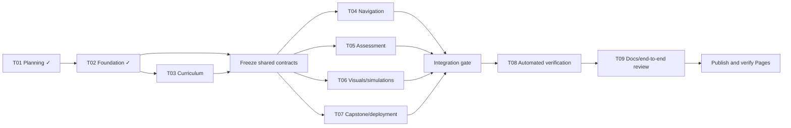

# Agent Execution Design

## Purpose and current state

This plan coordinates delivery of the learning site with small, verifiable context packets. It complements `01_implementation_plan.md` and `02_task_tracker.md`; the tracker remains the source of truth for status.

Current state (2026-06-21): T01-T10 are verified and T11 is in progress. The remaining release gate is no longer curriculum or integration work; it is a controlled publication pass: merge PR #1, enable Pages from GitHub Actions, observe the deployment, verify the public URL, and then close the manual keyboard/screen-reader/live-browser checklist that T09 deferred to T11. The tracker is the status source of truth; this document now exists to define ownership and handoff rules for that final pass.

## Dependency DAG



### Sequence versus parallel work

The wave breakdown below is historical context for how the repository was built. Active work should follow the current release sequence and assignment registry instead of reopening earlier waves.

1. **Sequential:** finish T03 coverage audit; freeze lesson, route, progress, quiz, visual, and capstone contracts.
2. **Parallel fan-out:** run T04, T05, T06, and T07 concurrently only after those contracts are recorded. Each stream works in its owned files or isolated additions.
3. **Sequential integration:** merge the four streams, resolve contract mismatches, then run T08. Validators may be drafted earlier, but their final pass depends on T02–T07.
4. **Sequential release:** complete T09 only after all automated checks pass; publish only after documentation, accessibility, and Pages gates pass.

Within T03, lesson prose can be audited in parallel by phase, but one curriculum owner must reconcile IDs, prerequisites, terminology, and ordering. Within T08, schema, link/asset, interaction, and accessibility checks can run in parallel against one immutable integration commit.

## Agent roster and metadata

Use one coordinator and bounded specialists; do not give multiple agents write ownership of the same file.

| Role | Primary responsibility | Owned paths during its work | Verification owned |
|---|---|---|---|
| Coordinator/integrator | Contracts, DAG, task assignment, reconciliation | tracker/plan updates and integration-only edits | final combined gate |
| Curriculum agent | T03 completeness and cross-phase consistency | `js/content.js` | schema and requirements coverage |
| Interaction agent | T04 routing, tree, search, preferences, progress | `js/app.js` and interaction-only markup/styles agreed in advance | keyboard, deep-link, storage flows |
| Assessment agent | T05 checks, remediation, mastery state | isolated assessment module or pre-agreed sections | answer/remediation integrity |
| Visual/capstone agents | T06 or T07 assets, simulations, starter/deployment | disjoint asset/module/workflow paths | text alternatives or Pages path checks |
| Quality agent | T08 validators and evidence | `scripts/`, test-report draft | complete automated suite |
| Documentation/release agent | T09 reader journey and release evidence | `README.md`, indexed `docs/` files | links, clean-start instructions, live URL |

Every assignment carries this metadata:

```yaml
agent_id: A04-interactions
task_ids: [T04]
objective: one measurable outcome
status: queued | active | blocked | review | done
depends_on: [contract-freeze]
input_commit: <git-sha-or-worktree-snapshot>
owned_paths: [js/app.js]
read_only_paths: [js/content.js, index.html]
forbidden_paths: [docs/TASK_TRACKER.md]
acceptance_checks: [node --check js/app.js, <focused behavior checks>]
token_budget: small | medium | large
handoff_to: coordinator
```

Only the coordinator changes status in `02_task_tracker.md`. Agents report evidence; they do not self-certify delivery tasks.

## Current pending-task assignment registry

The historical wave plan above remains valid, but the only open repository work is the release-verification wave. Use the following concrete packets for the remaining tasks and keep one writer for the evidence files.

## Current ordered release sequence

1. A11-release-owner merges PR #1 and captures the release commit that should appear on Pages.
2. A11-release-owner enables or confirms GitHub Actions as the Pages source and observes the deployment workflow.
3. A11-release-owner verifies the public URL, title, assets, and deep-link fallback.
4. A11-accessibility-review executes the deferred live manual checklist against that deployed site.
5. A11-coordinator records the resulting evidence in the tracker, test report, and README, then closes T11.

### A11-coordinator

```yaml
agent_id: A11-coordinator
task_ids: [T09, T11]
objective: keep the tracker, README, and test report aligned while integrating release and manual-verification evidence
status: active
depends_on: [T10]
input_commit: 4838377
owned_paths:
  - docs/02_planning/02_task_tracker.md
  - docs/05_testing/01_test_strategy_and_report.md
  - README.md
read_only_paths:
  - .github/workflows/pages.yml
  - docs/06_deployment/01_github_pages_deployment.md
  - docs/07_operations/01_operations_and_maintenance.md
forbidden_paths:
  - js/app.js
  - js/content.js
  - css/styles.css
acceptance_checks:
  - npm test
  - evidence from A11-release-owner and A11-accessibility-review recorded without contradiction
token_budget: medium
handoff_to: none
```

### A11-release-owner

```yaml
agent_id: A11-release-owner
task_ids: [T11]
objective: turn PR #1 into a live Pages deployment and capture the exact public URL and deployed commit
status: active
depends_on: [T10]
input_commit: 4838377
owned_paths: []
read_only_paths:
  - .github/workflows/pages.yml
  - 404.html
  - index.html
  - assets/**
forbidden_paths:
  - docs/02_planning/02_task_tracker.md
  - docs/05_testing/01_test_strategy_and_report.md
  - README.md
acceptance_checks:
  - gh pr view 1 --json state,mergeStateStatus,url
  - GitHub Pages source configured to GitHub Actions
  - pages workflow succeeds for the merged default-branch commit
  - public Pages URL returns HTTP 200 with the expected title
  - relative assets and deep-link fallback respond correctly
token_budget: small
handoff_to: A11-coordinator
```

### A11-accessibility-review

```yaml
agent_id: A11-accessibility-review
task_ids: [T09, T11]
objective: execute the deferred manual release checklist against the live site and return pass/fail evidence item by item
status: queued
depends_on: [A11-release-owner]
input_commit: merged default-branch Pages deployment commit
owned_paths: []
read_only_paths:
  - docs/05_testing/01_test_strategy_and_report.md
  - README.md
  - index.html
  - js/app.js
  - css/styles.css
forbidden_paths:
  - docs/02_planning/02_task_tracker.md
acceptance_checks:
  - keyboard-only tree, lesson, quiz, copy, panel, and checklist use
  - deep links plus browser Back/Forward
  - Windows/macOS/Linux command switching
  - hint/remediation/completion/review/export/reset flows
  - narrow layout, 200% zoom, dark theme, reduced motion, and print
  - screen-reader landmarks, labels, status messages, and visual alternatives
token_budget: medium
handoff_to: A11-coordinator
```

## Context packets and token-efficient handoffs

An agent receives the minimum sufficient packet:

1. Objective, task IDs, dependency status, and exact acceptance criteria.
2. Owned/read-only/forbidden paths and the input commit or snapshot.
3. Relevant requirement anchors, not the full requirements document (for example, “§6.2, §6.4, §11” for navigation).
4. Current interface contract: exported symbols, data fields, route/storage keys, and expected DOM hooks.
5. Focused commands to inspect and verify the work.
6. Known risks and one escalation contact: the coordinator.

Agents first use `rg` to locate anchors and read only the relevant ranges. They should not paste full files, logs, requirements, or diffs into handoffs. A handoff is capped to:

```text
Outcome: <1–2 sentences>
Changed: <paths and exported/API effects>
Checks: <command -> result>
Contract changes: <none, or exact old -> new>
Risks/blockers: <none, or actionable item>
Next: <single recommended action>
```

Store durable detail in repository files or test output; send only paths and decisive excerpts. Reuse an existing agent for follow-up work when its loaded context is still relevant. Start a new agent when ownership or domain changes materially.

## Collision and integration rules

- One writer per file per integration window. Shared files (`index.html`, `css/styles.css`, `js/content.js`, `js/app.js`, tracker, workflow) require coordinator assignment.
- Prefer new focused modules/assets over concurrent edits to a monolithic file. The coordinator alone wires modules into shared entry points.
- Agents inspect the working tree before editing and preserve unrelated changes. If an owned file changed since `input_commit`, stop and request rebasing/reassignment.
- No agent renames or reformats shared files incidentally. Mechanical repository-wide changes occur in a dedicated integration step.
- Contract changes require a short proposal before implementation: affected consumers, migration, and checks. Downstream agents continue against the last frozen contract.
- Commit one logical task at a time with the task ID in the message. Cherry-pick only complete, verified commits onto the integration branch; never cherry-pick partial shared-file conflict resolutions blindly.
- Resolve conflicts by contract and acceptance criteria, not by choosing “ours” or “theirs” wholesale.

## Verification ownership and gates

The author runs focused checks; a different agent or coordinator reviews evidence. Ownership is explicit:

| Gate | Accountable owner | Required evidence |
|---|---|---|
| Contract freeze | Coordinator + curriculum agent | unique lesson IDs, valid prerequisites/remediation targets, stable exports |
| Stream acceptance | Stream agent | syntax plus focused functional checks and changed-path summary |
| Integration | Coordinator | all consumers use frozen contracts; no unresolved shared-file changes |
| Automated quality | Quality agent | `npm test` passes; structure, content, links/assets, answers, and coverage validated |
| Accessibility/manual | Documentation/release agent, reviewed by coordinator | keyboard, narrow viewport, focus, deep links, OS/shell switching, progress flows |
| Deployment | Release owner | workflow success, Pages URL HTTP success, relative assets and 404/deep links verified |

A task is `done` only when its acceptance evidence exists and its downstream contract is stable. A failing downstream check returns to the owner of the originating contract or change; the quality agent diagnoses but does not silently rewrite feature behavior.

## Recommended execution waves

- **Wave 1:** T03 audit and contract freeze.
- **Wave 2:** T04–T07 in parallel with disjoint path ownership; draft T08 validators against the frozen schema.
- **Wave 3:** integrate, run T08, repair failures by owning stream.
- **Wave 4:** T09, repository/document indexing, GitHub Actions/Pages release, live-site verification.
- **Current open slice:** A11-release-owner executes the deployment path, A11-accessibility-review verifies the live learner flows, and A11-coordinator records the final evidence and closes T11.

This arrangement keeps the critical path sequential where interfaces matter and uses parallel agents only where work can be merged without duplicating context or creating shared-file conflicts.
