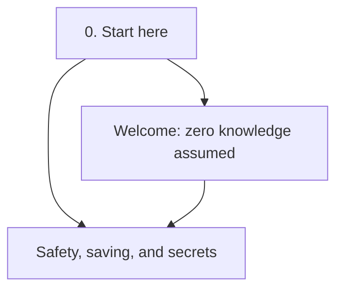
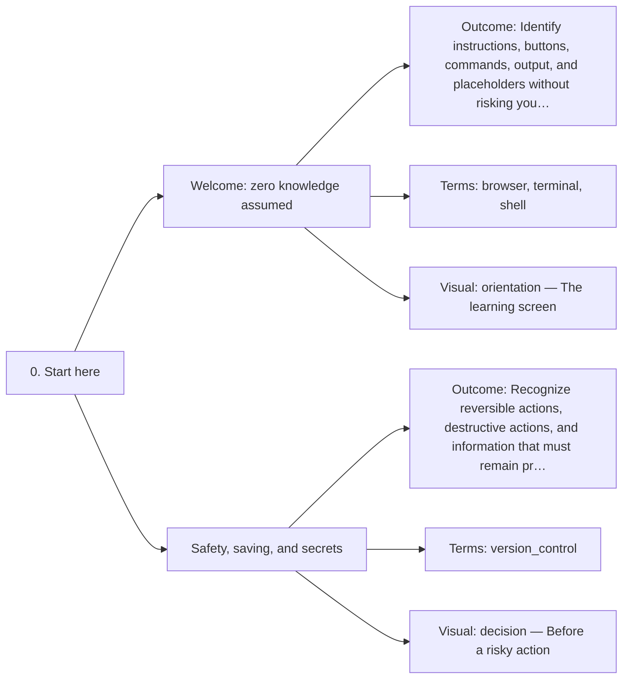

# 0. Start here — Code Diagrams

Use the course safely and learn basic computer actions.

## Lesson sequence

## Concept coverage

## Text summary

- **Welcome: zero knowledge assumed** — Identify instructions, buttons, commands, output, and placeholders without risking your computer.
- **Safety, saving, and secrets** — Recognize reversible actions, destructive actions, and information that must remain private.
