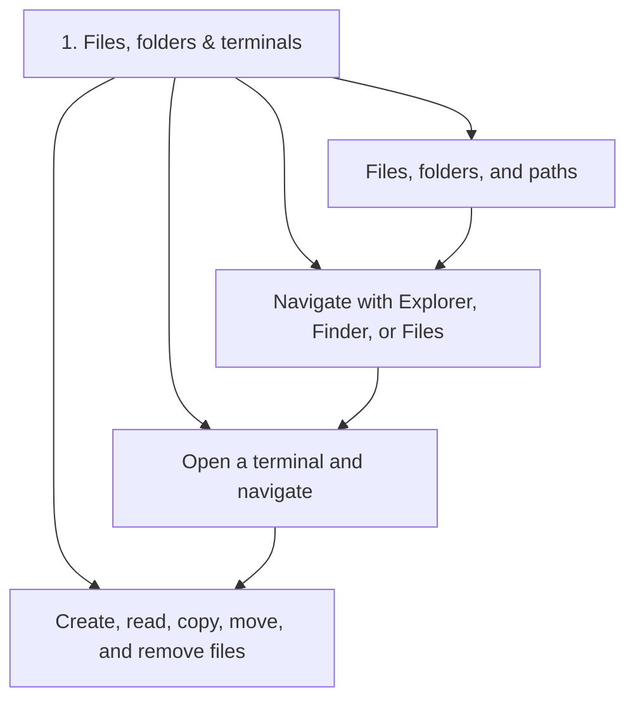
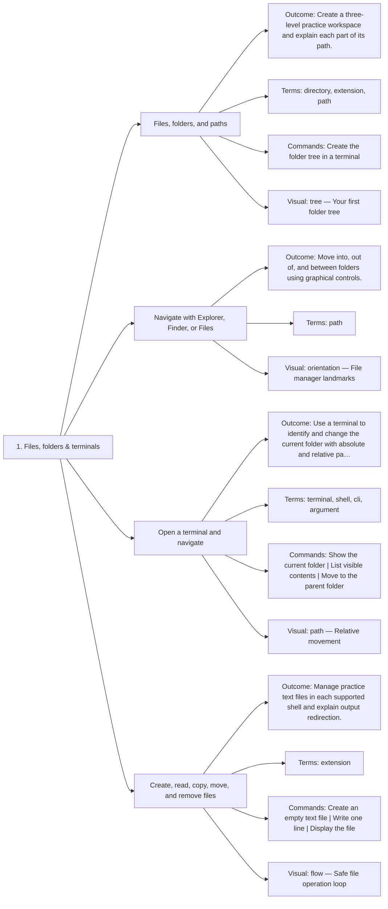

# 1. Files, folders & terminals — Code Diagrams

Learn where work lives and how to move around safely.

## Lesson sequence

## Concept coverage

## Text summary

- **Files, folders, and paths** — Create a three-level practice workspace and explain each part of its path.
- **Navigate with Explorer, Finder, or Files** — Move into, out of, and between folders using graphical controls.
- **Open a terminal and navigate** — Use a terminal to identify and change the current folder with absolute and relative paths.
- **Create, read, copy, move, and remove files** — Manage practice text files in each supported shell and explain output redirection.
