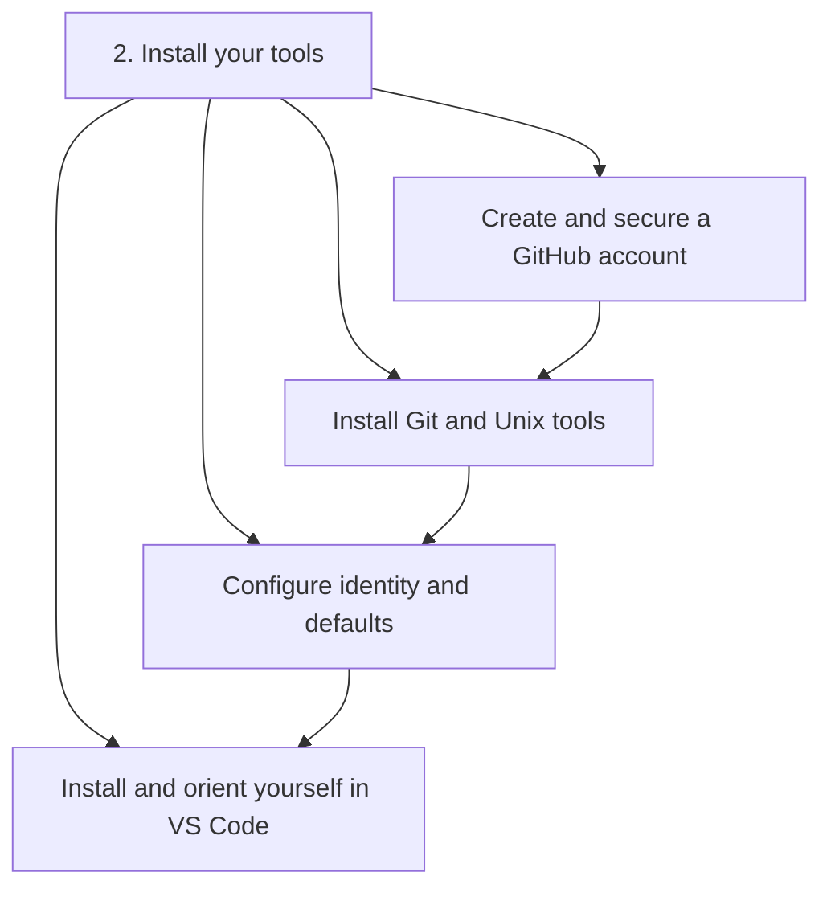
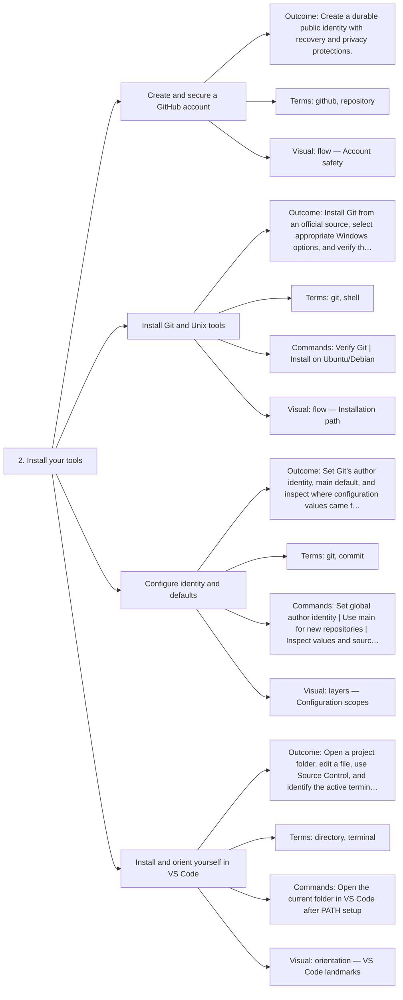

# 2. Install your tools — Code Diagrams

Prepare Git, GitHub, and VS Code safely.

## Lesson sequence

## Concept coverage

## Text summary

- **Create and secure a GitHub account** — Create a durable public identity with recovery and privacy protections.
- **Install Git and Unix tools** — Install Git from an official source, select appropriate Windows options, and verify the executable.
- **Configure identity and defaults** — Set Git’s author identity, main default, and inspect where configuration values came from.
- **Install and orient yourself in VS Code** — Open a project folder, edit a file, use Source Control, and identify the active terminal shell.
