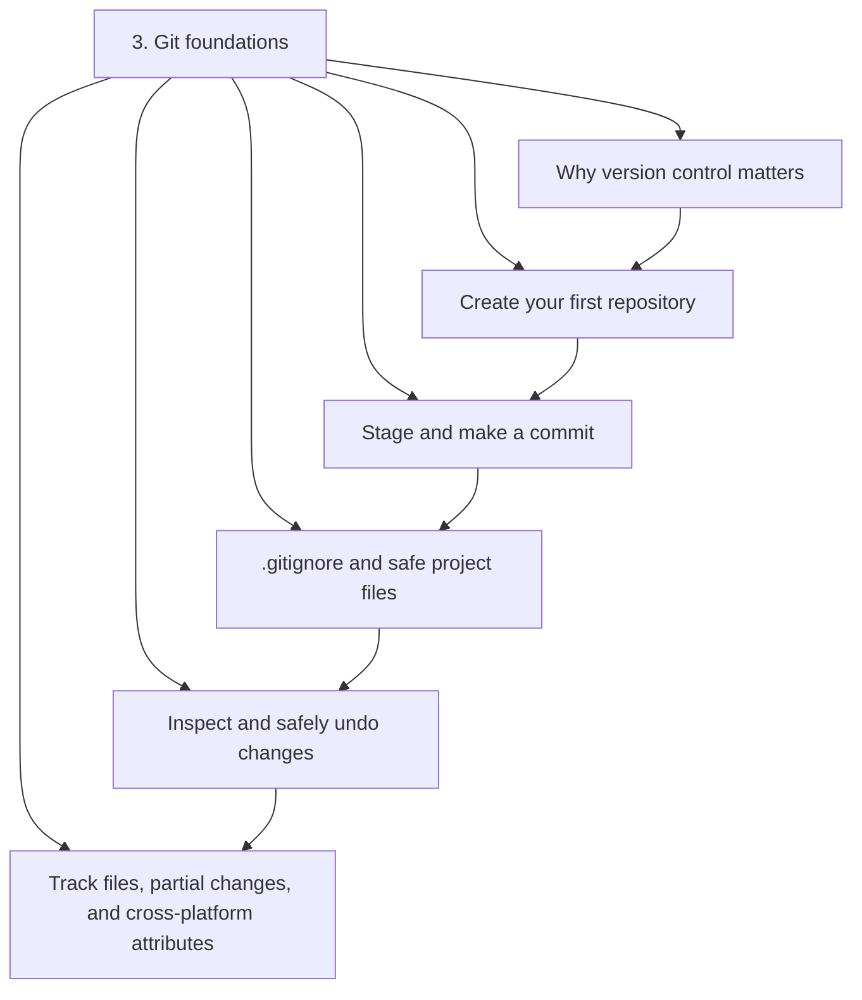
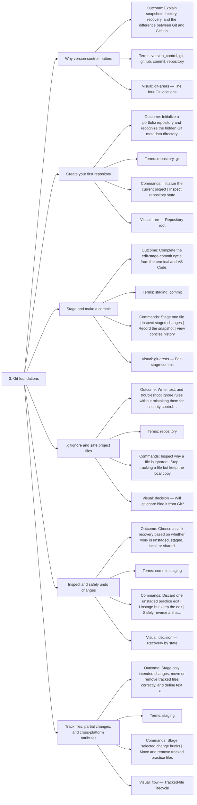

# 3. Git foundations — Code Diagrams

Record clear, safe project history.

## Lesson sequence

## Concept coverage

## Text summary

- **Why version control matters** — Explain snapshots, history, recovery, and the difference between Git and GitHub.
- **Create your first repository** — Initialize a portfolio repository and recognize the hidden Git metadata directory.
- **Stage and make a commit** — Complete the edit-stage-commit cycle from the terminal and VS Code.
- **.gitignore and safe project files** — Write, test, and troubleshoot ignore rules without mistaking them for security controls.
- **Inspect and safely undo changes** — Choose a safe recovery based on whether work is unstaged, staged, local, or shared.
- **Track files, partial changes, and cross-platform attributes** — Stage only intended changes, move or remove tracked files correctly, and define text and binary behavior across operating systems.
