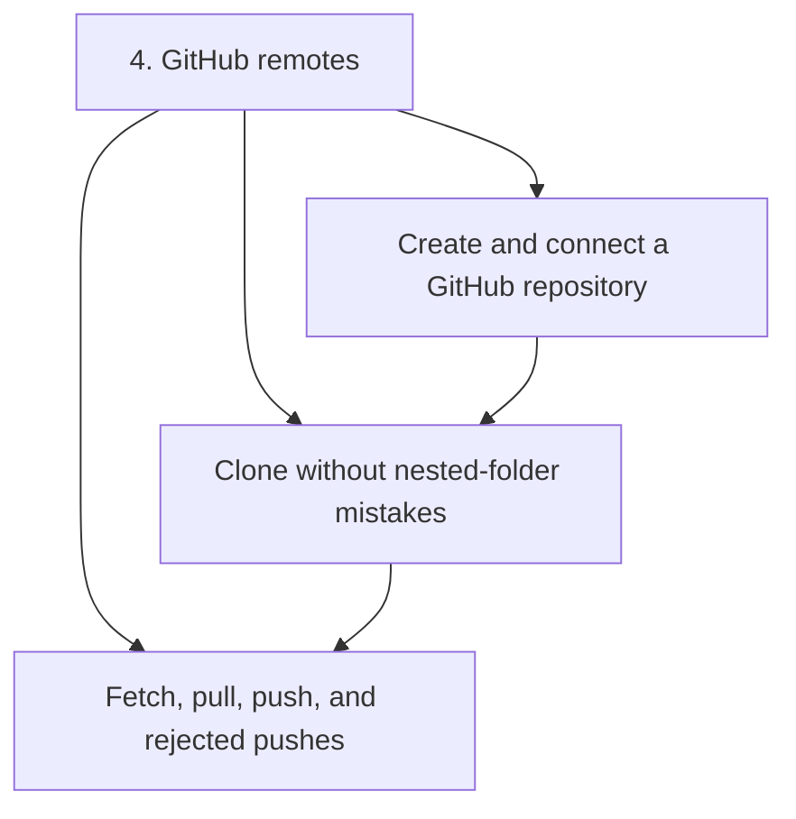
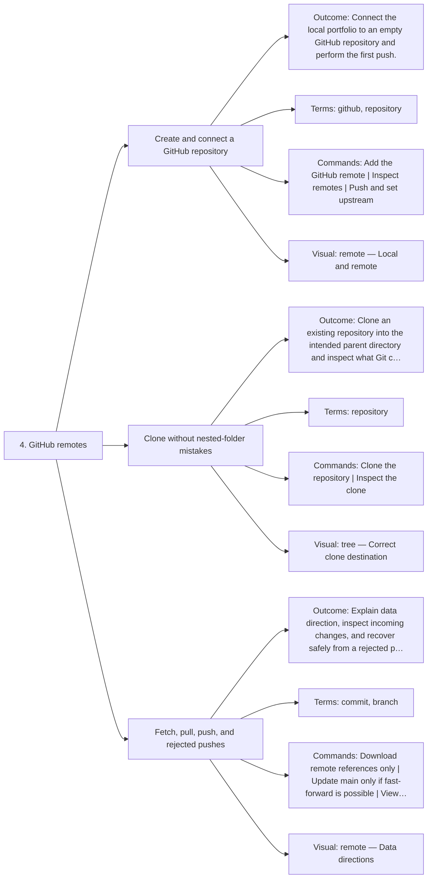

# 4. GitHub remotes — Code Diagrams

Connect, clone, fetch, pull, and push.

## Lesson sequence

## Concept coverage

## Text summary

- **Create and connect a GitHub repository** — Connect the local portfolio to an empty GitHub repository and perform the first push.
- **Clone without nested-folder mistakes** — Clone an existing repository into the intended parent directory and inspect what Git configured.
- **Fetch, pull, push, and rejected pushes** — Explain data direction, inspect incoming changes, and recover safely from a rejected push.
