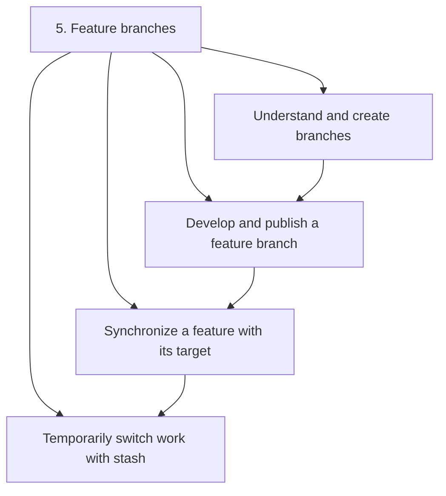
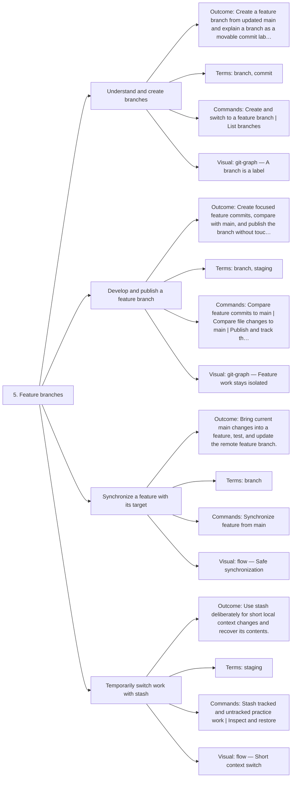

# 5. Feature branches — Code Diagrams

Develop independently and synchronize safely.

## Lesson sequence

## Concept coverage

## Text summary

- **Understand and create branches** — Create a feature branch from updated main and explain a branch as a movable commit label.
- **Develop and publish a feature branch** — Create focused feature commits, compare with main, and publish the branch without touching main.
- **Synchronize a feature with its target** — Bring current main changes into a feature, test, and update the remote feature branch.
- **Temporarily switch work with stash** — Use stash deliberately for short local context changes and recover its contents.
