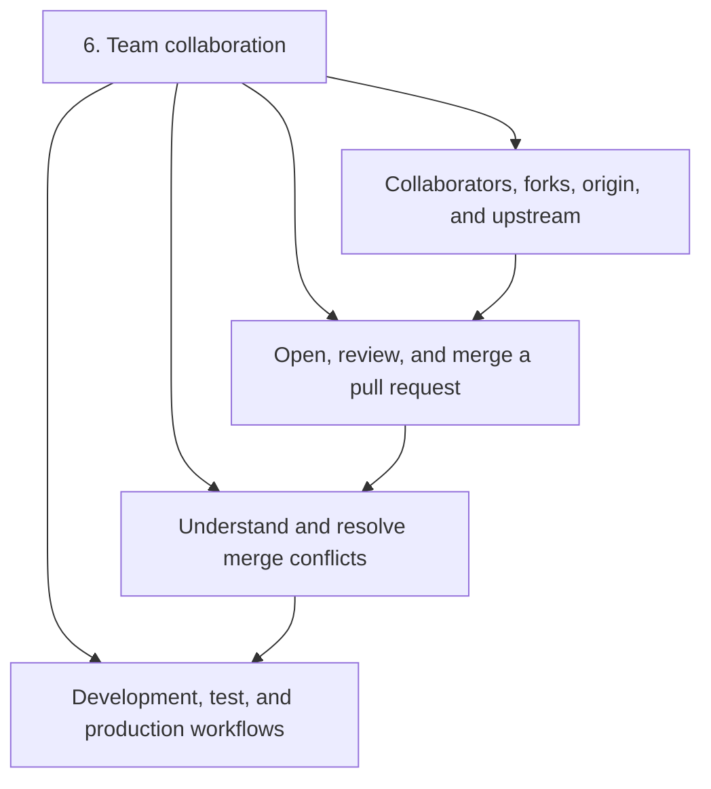
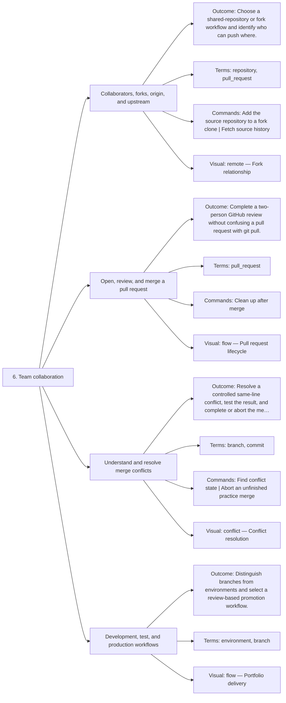

# 6. Team collaboration — Code Diagrams

Review, merge, resolve conflicts, and promote safely.

## Lesson sequence

## Concept coverage

## Text summary

- **Collaborators, forks, origin, and upstream** — Choose a shared-repository or fork workflow and identify who can push where.
- **Open, review, and merge a pull request** — Complete a two-person GitHub review without confusing a pull request with git pull.
- **Understand and resolve merge conflicts** — Resolve a controlled same-line conflict, test the result, and complete or abort the merge.
- **Development, test, and production workflows** — Distinguish branches from environments and select a review-based promotion workflow.
