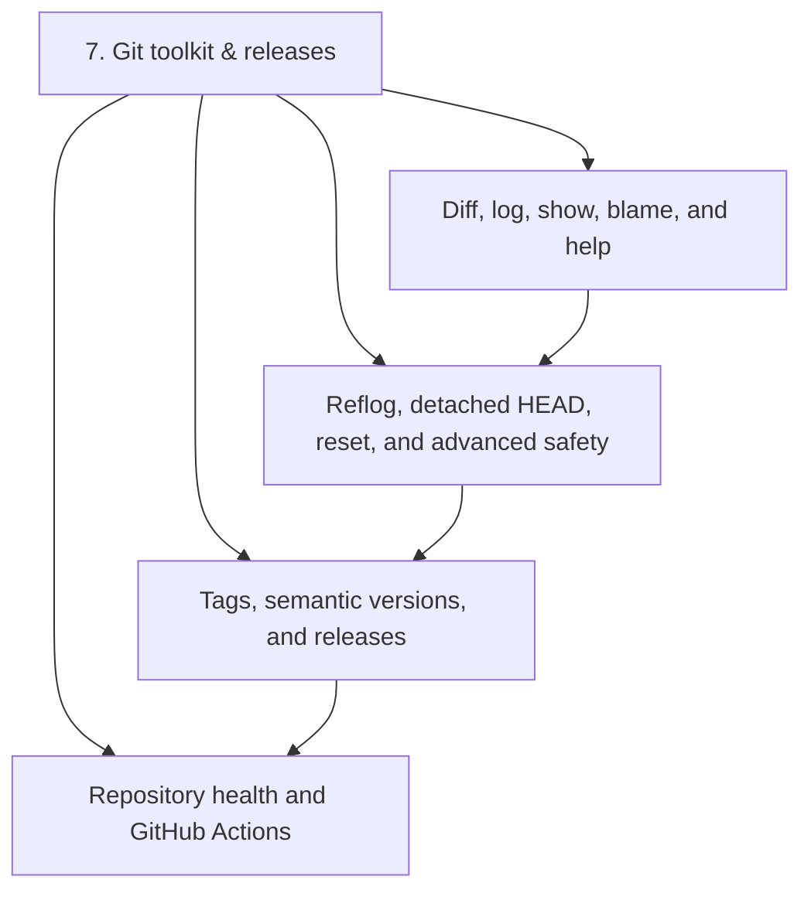
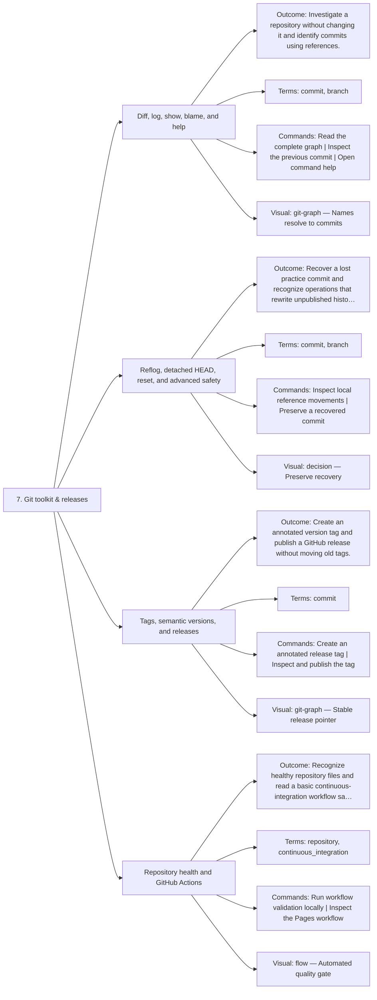

# 7. Git toolkit & releases — Code Diagrams

Investigate, recover, maintain, tag, and automate.

## Lesson sequence

## Concept coverage

## Text summary

- **Diff, log, show, blame, and help** — Investigate a repository without changing it and identify commits using references.
- **Reflog, detached HEAD, reset, and advanced safety** — Recover a lost practice commit and recognize operations that rewrite unpublished history.
- **Tags, semantic versions, and releases** — Create an annotated version tag and publish a GitHub release without moving old tags.
- **Repository health and GitHub Actions** — Recognize healthy repository files and read a basic continuous-integration workflow safely.
