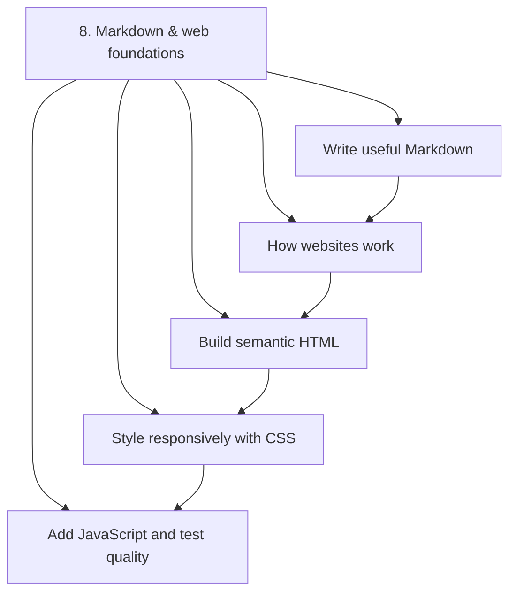
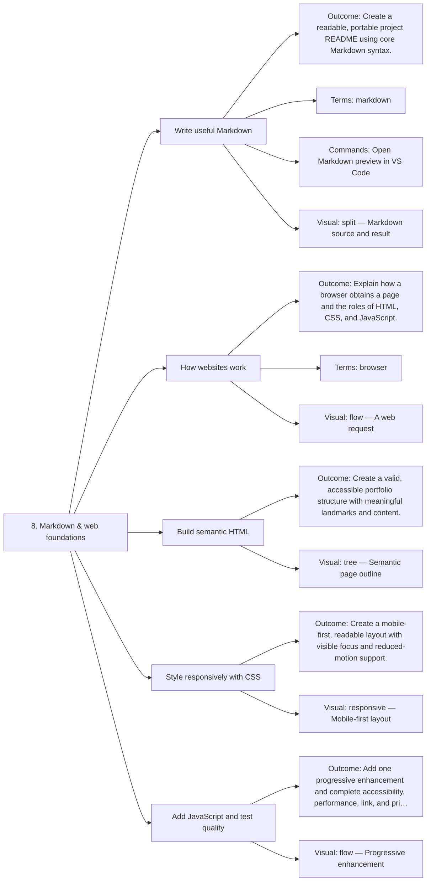

# 8. Markdown & web foundations — Code Diagrams

Document and build a real accessible website.

## Lesson sequence

## Concept coverage

## Text summary

- **Write useful Markdown** — Create a readable, portable project README using core Markdown syntax.
- **How websites work** — Explain how a browser obtains a page and the roles of HTML, CSS, and JavaScript.
- **Build semantic HTML** — Create a valid, accessible portfolio structure with meaningful landmarks and content.
- **Style responsively with CSS** — Create a mobile-first, readable layout with visible focus and reduced-motion support.
- **Add JavaScript and test quality** — Add one progressive enhancement and complete accessibility, performance, link, and privacy checks.
