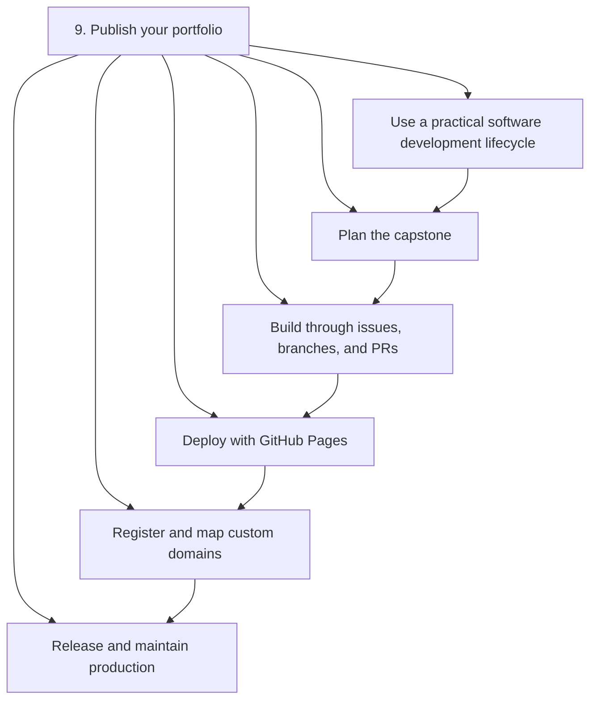
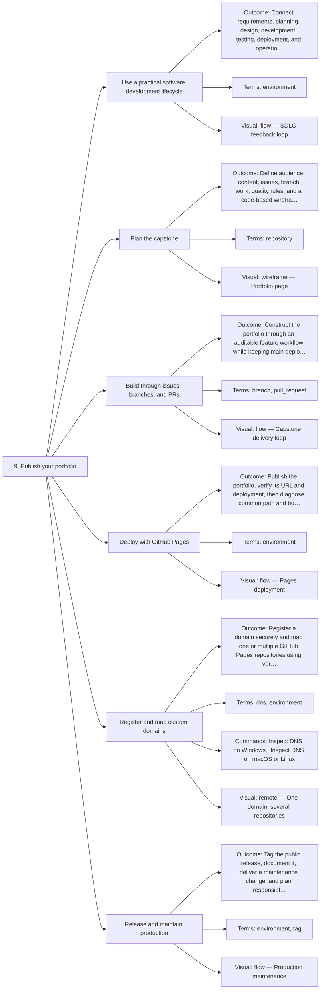

# 9. Publish your portfolio — Code Diagrams

Plan, build, deploy, release, and maintain your public work.

## Lesson sequence

## Concept coverage

## Text summary

- **Use a practical software development lifecycle** — Connect requirements, planning, design, development, testing, deployment, and operations through visible gates and feedback.
- **Plan the capstone** — Define audience, content, issues, branch work, quality rules, and a code-based wireframe before building.
- **Build through issues, branches, and PRs** — Construct the portfolio through an auditable feature workflow while keeping main deployable.
- **Deploy with GitHub Pages** — Publish the portfolio, verify its URL and deployment, then diagnose common path and build failures.
- **Register and map custom domains** — Register a domain securely and map one or multiple GitHub Pages repositories using verified DNS and HTTPS.
- **Release and maintain production** — Tag the public release, document it, deliver a maintenance change, and plan responsible next steps.
