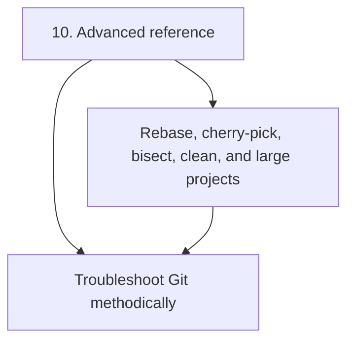
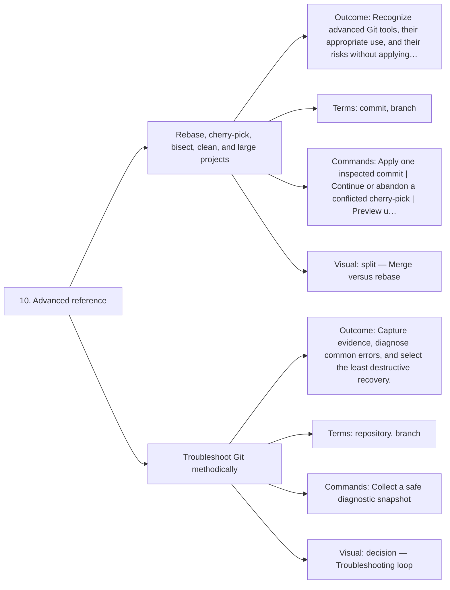

# 10. Advanced reference — Code Diagrams

Recognize specialist tools and troubleshoot methodically.

## Lesson sequence

## Concept coverage

## Text summary

- **Rebase, cherry-pick, bisect, clean, and large projects** — Recognize advanced Git tools, their appropriate use, and their risks without applying them blindly.
- **Troubleshoot Git methodically** — Capture evidence, diagnose common errors, and select the least destructive recovery.
